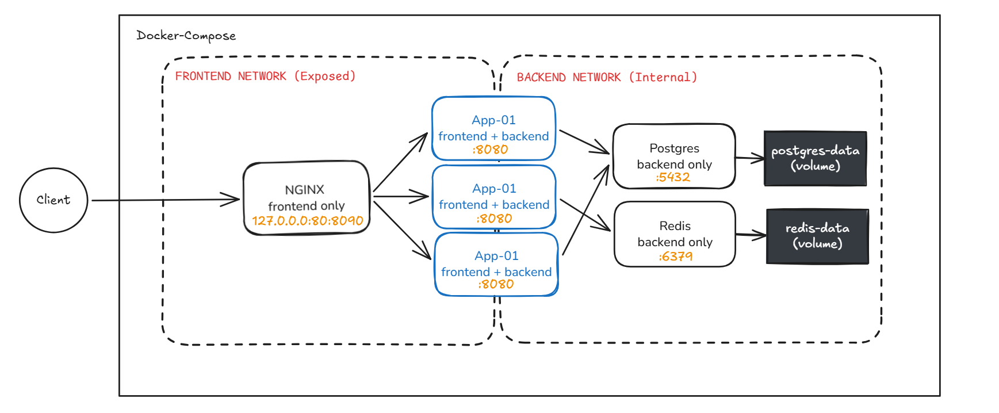

# BARQ Internship Task

## Application Architecture



## Request Flow
Client > NGINX localhost:8090:80 > apps  :8080 > PostgreSQL :5432 / Redis :6379
1. The client sends an HTTP request to 127.0.0.1:8080.
2. NGINX receives the request and load-balances it between app-01 app-02, and app-03.
3. The selected Flask application processes the request.
4. For database operations, the application connects to PostgreSQL using the postgres service name.
5. For cache/counter operations, the application connects to Redis using the redis service name.
6. The response returns through the selected application instance and NGINX to the client.

## Project Setup

### Configure environment variables

The project provides config/app.env.example as a template for the application and PostgreSQL environment variables.

Create your local environment file from the example:
```
cp .env.example config/app.env
```
Edit config/app.env and provide the required local values:

config/app.env contains environment-specific values and secrets and must not be committed to Git. Only config/app.env.example is tracked as a safe template.

### Start the environment

Build the application image and start all services in the background:
```
docker compose up -d --build
```
This starts:

- nginx
- app-01
- app-02
- app-03
- postgres
- redis

Only NGINX is exposed to the host:
```
127.0.0.1:8090
```

### Check container status

Verify that all services are running and healthy:
```
docker compose ps
```
The application containers wait for PostgreSQL and Redis to become healthy before starting.

### Verify application readiness

The /ready endpoint verifies connectivity to both PostgreSQL and Redis:
```
curl -s http://127.0.0.1:8090/ready
```
A successful response indicates that the application is ready to serve requests.

### Test the application

Test the available endpoints through NGINX:
```
curl -s http://127.0.0.1:8090/
curl -s http://127.0.0.1:8090/health
curl -s http://127.0.0.1:8090/instance
curl -s http://127.0.0.1:8090/ready
curl -s http://127.0.0.1:8090/records
curl -s http://127.0.0.1:8090/counter
```
To verify that NGINX distributes requests between the three application instances:
```
for i in {1..15}; do
    curl -s http://127.0.0.1:8090/instance
    echo
done
```
The responses should show requests being served by app-01, app-02, and app-03.

### View logs

View all service logs:
```
docker compose logs
```
Follow logs in real time:
```
docker compose logs -f
```
View a specific service's logs:
```
docker compose logs -f nginx
docker compose logs -f app-01
docker compose logs -f app-02
docker compose logs -f app-03
docker compose logs -f postgres
docker compose logs -f redis
```

### Stop the environment

Stop the containers without removing them:
```
docker compose stop
```
### Start the environment again
```
docker compose start
```

### Remove the environment

Remove the containers and networks while keeping the named volumes:
```
docker compose down
```
If you want to delete whole project with volumes created: 
```
docker compose down -v
```
Note that this command will remove all persistent volumes so you might lose all your data if you havent took a backup.

## Validation and Failure Scripts

### validate.py

validate.py is the project's automated end-to-end validation script. It verifies that the environment satisfies the required functional, networking, and isolation requirements.

It checks:

- NGINX public accessibility
- Application health and readiness
- Required application endpoints
- Application instances are serving requests
- PostgreSQL and Redis availability
- PostgreSQL record operations
- Redis counter operations
- Expected public host port
- Docker network isolation
- Prohibited host port exposure

Run the validation script from the project root:
```
python3 ./validate.py
```
The script prints PASS/FAIL results for its checks and exits with:

- 0 when validation succeeds
- a non-zero status when a required check fails

This makes the script suitable for both local verification and CI.

### failure_test.py

failure_test.py verifies the application's behavior when one backend application instance becomes unavailable.

The test:

- Confirms that app-01, app-02, and app-03 are initially serving traffic.
- Stops one application instance.
- Verifies that the service remains accessible through the surviving instances.
- Starts the stopped instance again.
- Waits for it to become healthy.
- Verifies that all three instances are serving traffic again.

Run it with:
```
python3 ./failure_test.py
```
The final public port for the live environment is 8090. Provide the base URL explicitly when needed:
```
BASE_URL=http://127.0.0.1:8090
```

After starting the environment, run:
```
python3 ./validate.py
python3 ./failure_test.py
```
Then run validation again to confirm that the environment has fully recovered:
```
python3 ./validate.py
```
The failure test is intentionally separate from validate.py: validate.py verifies the normal system state, while failure_test.py deliberately introduces a backend failure and verifies recovery.


## Backup and Restore Scripts

This project uses a named PostgreSQL volume plus simple backup and restore scripts to manage database state during the assessment.

### `backup.sh` — logical PostgreSQL backup

`backup.sh` creates a SQL dump of the `barq_tasks` database using `pg_dump` and writes
it to a timestamped file in the `backups/` directory. The file is a portable logical
backup (SQL statements) and is independent from the named volume.

Quick usage:

```bash
./backup.sh
# produces: backups/barq_tasks_YYYYMMDD_HHMMSS.sql
```

What it does:
- Verifies the `postgres` container is running.
- Creates `backups/` if missing.
- Runs `pg_dump` as `barq_app` and saves the SQL file.
- Verifies the file exists and is non-empty.

Note: the backup file is not automatically uploaded or stored remotely — keep copies
if you need off-host retention.


### `restore.sh` — restore from a logical backup 

`restore.sh` restores a database from a previously created SQL dump. The operation is destructive for the `barq_tasks` database and therefore requires an explicit confirmation.

Quick usage:

```bash
./restore.sh backups/barq_tasks_YYYYMMDD_HHMMSS.sql
# confirm with: y
```

What it does:
- Validates the backup file exists and is non-empty.
- Stops application containers (`app-01`, `app-02`) to avoid open DB connections.
- Drops and recreates the `barq_tasks` database as `barq_app`.
- Restores the SQL dump using `psql` (stdin).
- Restarts the application containers.

Example interactive output:

```
DROP DATABASE
CREATE DATABASE
COPY 11
PASS: PostgreSQL restore completed.
```

This restores the database to the exact state captured by the SQL dump. Any records created after the backup will be lost after a restore.

## CI / GitHub Actions

The project uses **GitHub Actions** to automatically verify the Docker Compose environment on every push and pull request.

### Workflow

The CI workflow performs the following steps:

1. **Checkout** the repository.
2. **Prepare the CI environment** by creating `config/app.env` from the tracked `.env.example`.
3. **Run syntax checks** for the Python application, validation scripts, and Bash scripts.
4. **Validate the Docker Compose configuration** with `docker compose config`.
5. **Build** the Docker images.
6. **Start** the complete environment with Docker Compose.
7. **Wait for application readiness** through the `/ready` endpoint.
8. **Run `validate.py`** to verify:

   * Public NGINX access
   * Application endpoints
   * PostgreSQL and Redis functionality
   * Both application instances
   * Network isolation
   * Published host ports
   * Database and Redis operations
9. **Collect Docker logs** if the workflow encounters a failure.
10. **Clean up** the Compose environment after the job finishes.

### CI Configuration

The workflow is located at:

```text
.github/workflows/ci.yml
```

It runs on:

* Pushes
* Pull requests

The CI job fails if the application does not become ready or if `validate.py` reports a validation failure.

### Environment Variables

The real `config/app.env` file is intentionally excluded from Git because it may contain sensitive configuration.

For CI, the workflow creates it from:

```text
.env.example
    ↓
config/app.env
```

The example file contains non-sensitive values suitable for the CI environment.

### CI Verification Link

[CI run for final commit](https://github.com/Mo7iee/BARQ-Task/actions/runs/35713799717)

## Documentation

| File                                       | Description                                                                                                 |
| ------------------------------------------ | ----------------------------------------------------------------------------------------------------------- |
| [`troubleshooting.md`](troubleshooting.md) | Investigation journal covering symptoms, hypotheses, commands, fixes, failed attempts, and verification.    |
| [`log_analysis.md`](log_analysis.md)       | Analysis of the provided logs, including counts, correlations, timeline, and conclusions.                   |
| [`decisions.md`](decisions.md)             | Key technical decisions, alternatives, trade-offs, assumptions, and limitations.                            |
| [`security_review.md`](security_review.md) | Security and production-readiness review covering risks, implemented controls, and production improvements. |
| [`AI_USAGE.md`](AI_USAGE.md)               | Disclosure of AI assistance, affected files, changes, and independent verification.                         |
